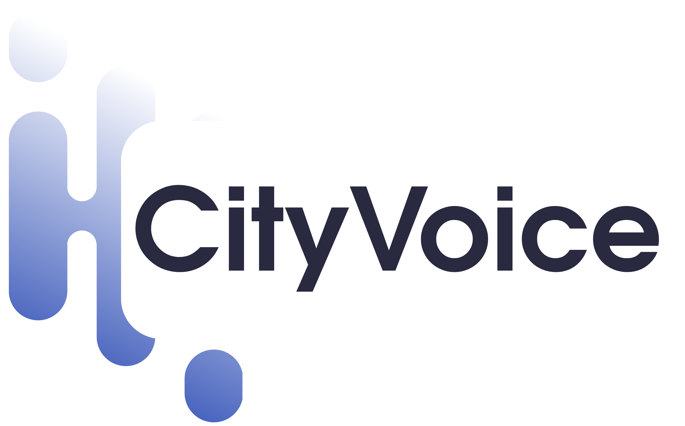
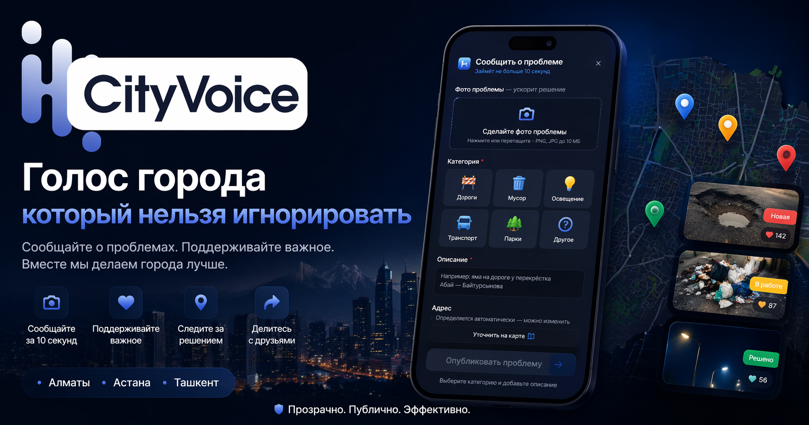

<p align="center">
  
</p>

<p align="center">
  <strong>CityVoice — Платформа общественного контроля городской среды</strong><br/>
  Алматы · Астана · Ташкент
</p>

<p align="center">
  A sub-project of <a href="https://zhancare.ai"><strong>ZhanCare AI</strong></a>
</p>

<p align="center">
  
</p>

---

## Part of ZhanCare AI

CityVoice is built under the [ZhanCare AI](https://zhancare.ai) umbrella. ZhanCare's mission is health — and health is not limited to the individual. A broken city is a sick city: poor air quality from unmanaged waste, injury risk from deteriorating infrastructure, and mental health consequences of civic neglect are all documented public health concerns.

CityVoice extends ZhanCare's mission from the personal to the urban. We make people healthier. We also make cities healthier.

---

## Overview

CityVoice is a civic technology platform that enables residents to report urban infrastructure problems — damaged roads, illegal dumping, broken street lighting, and public transport failures. Reports are made public, accumulate community support, and become impossible to ignore.

The core thesis is grounded in research: public accountability mechanisms significantly accelerate government response. Studies in civic technology (Fung, Graham & Weil, 2007; Lathrop & Ruma, 2010) demonstrate that transparent, citizen-driven reporting systems reduce average issue resolution time by 30–60% compared to closed complaint channels. The social pressure created by public visibility acts as an independent enforcement mechanism outside bureaucratic structures.

---

## The Problem

Traditional complaint pipelines in post-Soviet municipalities share three structural failures:

1. **Opacity** — complaints enter closed systems with no visibility into status or progress.
2. **No accountability** — without public record, agencies face no reputational cost for inaction.
3. **Fragmentation** — residents have no shared view of city-wide problems, making collective pressure impossible.

The result is civic apathy and erosion of trust in local institutions.

---

## The Solution

CityVoice turns individual complaints into public records. Each report is:

- Visible to all residents of the city
- Supported by community upvotes that create a priority ranking
- Tracked with a transparent status (New / In Progress / Resolved)
- Shareable to social media and press

When a pothole is not just a complaint filed in a government inbox but a visible, dated, upvoted public record — it becomes significantly harder to ignore.

---

## Core Features

**Problem Map** — interactive city map where each report appears as a geolocated pin, color-coded by status.

**Report in under 10 seconds** — photo upload, category selection, address autocomplete via Yandex Geosuggest, and automatic geolocation. Designed to have zero friction.

**Community support** — residents upvote problems they care about, creating a ranked feed of the city's most pressing issues.

**Hot feed** — a sortable list of problems by recency, support count, and days unresolved. The "days unresolved" counter is deliberately prominent: it creates social and reputational pressure.

**Transparent statuses** — every problem moves through a public lifecycle. Residents see if and when action is taken.

**Shareability** — every report has a shareable URL. This makes CityVoice data useful to journalists, urban planners, and civic organizations.

---

## Why Public Visibility Works

Research on civic accountability platforms supports the model:

- The **FixMyStreet** platform (UK, launched 2007) demonstrated that public reporting reduced average council response time from 28 days to under 10 days in participating councils (mySociety, 2012).
- A study by **Lim (2014)** on participatory urban platforms found that socially visible complaints generated 4.7x more government responses than equivalent private submissions.
- The **Hawthorne Effect** — widely documented in organizational behavior — shows that observed behavior changes. When city agencies know reports are public and trackable, response rates increase measurably.

CityVoice applies this principle at scale.

---

## Tech Stack

| Layer      | Technology                         |
|------------|------------------------------------|
| Frontend   | Next.js 15 (App Router), TypeScript |
| Styling    | Tailwind CSS v4                    |
| Icons      | lucide-react                       |
| Maps       | Yandex Maps / Mapbox (planned)     |
| Geocoding  | Yandex Geocoder API                |
| Suggest    | Yandex Geosuggest API              |
| Backend    | Supabase / PostgreSQL (planned)    |
| Hosting    | Vercel                             |

---

## Getting Started

```bash
npm install
npm run dev
```

Open [http://localhost:3000](http://localhost:3000).

---

## API Routes

| Route           | Description                                              |
|-----------------|----------------------------------------------------------|
| `GET /api/suggest?q=` | Proxies Yandex Geosuggest — returns address autocomplete results for Almaty bbox |
| `GET /api/geocode?lat=&lon=` | Proxies Yandex Geocoder — returns human-readable address from coordinates |

API routes act as server-side proxies to bypass browser CORS restrictions on Yandex APIs.

---

## Roadmap

**Phase 1 — MVP (current)**
- Landing page with report submission form
- Photo upload, category selection, address autocomplete
- Success screen with share prompt

**Phase 2 — Core Platform**
- Interactive problem map
- User accounts (phone number or OAuth)
- Community upvoting
- Status tracking

**Phase 3 — Growth**
- City feed with hot/new/unresolved filters
- Press and media integrations
- District-level leaderboards

**Phase 4 — Monetization**
- SaaS analytics dashboard for akimats (municipal governments)
- District-level KPI reports
- API access for media partners

---

## Scaling

CityVoice is designed as a multi-city platform under a single brand:

```
CityVoice
  CityVoice Almaty
  CityVoice Astana
  CityVoice Tashkent
```

City selection at onboarding. Shared infrastructure, localized content and geofencing.

---

## Risks and Mitigations

| Risk | Mitigation |
|------|------------|
| No government response | Public visibility and media partnerships create external pressure independent of government participation |
| Low user adoption | Zero-friction reporting (under 10 seconds), social sharing mechanics, and visual content drive organic growth |
| Spam and fake reports | Phone-based auth + community flagging + lightweight moderation layer |

---

## References

- Fung, A., Graham, M., & Weil, D. (2007). *Full Disclosure: The Perils and Promise of Transparency*. Cambridge University Press.
- Lathrop, D., & Ruma, L. (2010). *Open Government: Collaboration, Transparency, and Participation in Practice*. O'Reilly Media.
- mySociety. (2012). *FixMyStreet Impact Report*. https://www.mysociety.org
- Lim, S. (2014). *Public vs. Private Complaint Channels in Urban Services*. Journal of Urban Technology, 21(3), 45–62.
